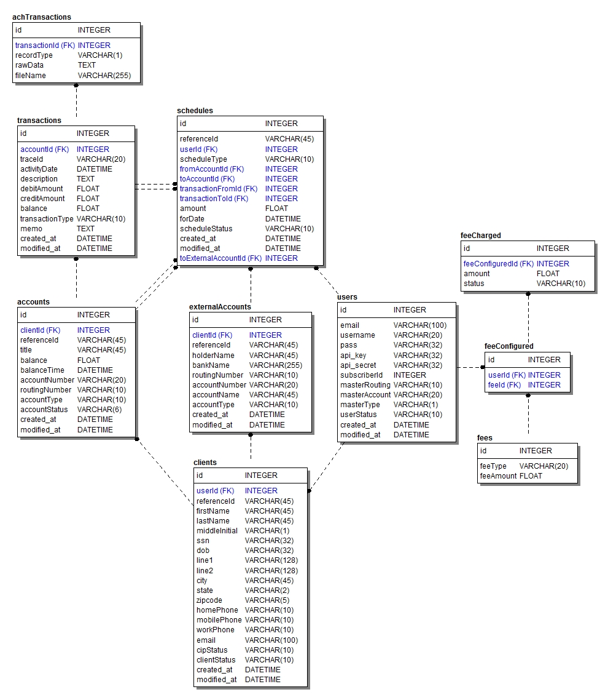

Project X
===
##The way we work (please be kind to read)

Right now there are two main branches **master** and **develop**.
Master deploys to production (<this needs a production server>.refundo.com) and develop to staging (x.refundo.com).

For more information, you can read this gitflow: [nvie.com/posts/a-successful-git-branching-model/](http://nvie.com/posts/a-successful-git-branching-model/)

Also, if you install [SmartGit](http://www.syntevo.com/smartgithg/) the flow is already there.

So any change must be first on develop, then merge it to master. And with this everyone is happy :smile:

##Steps for local configuration

1. Clone to your local rto folder

    1.1 Git hub clients:
    * For windows: [windows.github.com](http://windows.github.com/)
    * For mac: [mac.github.com](http://mac.github.com/)
    * On Centos run this line: `yum install git-core`

    1.2 On command line you can clone with this: `git clone git@github.com:refundo/x.git /path/to/rto/`

    1.3 Then use branch develop `git checkout develop`

1. Create a `.htaccess` file on root folder with the following:

    ```ApacheConf
        <IfModule mod_rewrite.c>
            RewriteEngine On
            RewriteCond %{REQUEST_FILENAME} !-f
            RewriteCond %{REQUEST_FILENAME} !-d
            RewriteCond $1 !^(favicon\.gif|favicon\.ico|index\.php|img|css|js|robots\.txt)
            RewriteRule ^(.*)$ /x/index.php?/$1 [QSA,L]
        </IfModule>
        <IfModule !mod_rewrite.c>
            ErrorDocument 404 /x/index.php
        </IfModule>
    ```
1. Create a `database.php` under `/application/config/` with the following:
    ```html+php
        <?php  if ( ! defined('BASEPATH')) exit('No direct script access allowed');
        /*
        | -------------------------------------------------------------------
        | DATABASE CONNECTIVITY SETTINGS
        | -------------------------------------------------------------------
        | This file will contain the settings needed to access your database.
        |
        | For complete instructions please consult the 'Database Connection'
        | page of the User Guide.
        |
        | -------------------------------------------------------------------
        | EXPLANATION OF VARIABLES
        | -------------------------------------------------------------------
        |
        |	['hostname'] The hostname of your database server.
        |	['username'] The username used to connect to the database
        |	['password'] The password used to connect to the database
        |	['database'] The name of the database you want to connect to
        |	['dbdriver'] The database type. ie: mysql.  Currently supported:
        				 mysql, mysqli, postgre, odbc, mssql, sqlite, oci8
        |	['dbprefix'] You can add an optional prefix, which will be added
        |				 to the table name when using the  Active Record class
        |	['pconnect'] TRUE/FALSE - Whether to use a persistent connection
        |	['db_debug'] TRUE/FALSE - Whether database errors should be displayed.
        |	['cache_on'] TRUE/FALSE - Enables/disables query caching
        |	['cachedir'] The path to the folder where cache files should be stored
        |	['char_set'] The character set used in communicating with the database
        |	['dbcollat'] The character collation used in communicating with the database
        |				 NOTE: For MySQL and MySQLi databases, this setting is only used
        | 				 as a backup if your server is running PHP < 5.2.3 or MySQL < 5.0.7
        |				 (and in table creation queries made with DB Forge).
        | 				 There is an incompatibility in PHP with mysql_real_escape_string() which
        | 				 can make your site vulnerable to SQL injection if you are using a
        | 				 multi-byte character set and are running versions lower than these.
        | 				 Sites using Latin-1 or UTF-8 database character set and collation are unaffected.
        |	['swap_pre'] A default table prefix that should be swapped with the dbprefix
        |	['autoinit'] Whether or not to automatically initialize the database.
        |	['stricton'] TRUE/FALSE - forces 'Strict Mode' connections
        |							- good for ensuring strict SQL while developing
        |
        | The $active_group variable lets you choose which connection group to
        | make active.  By default there is only one group (the 'default' group).
        |
        | The $active_record variables lets you determine whether or not to load
        | the active record class
        */

        $active_group = 'default';
        $active_record = TRUE;

        $db['default']['hostname'] = 'localhost';
        $db['default']['username'] = 'root';
        $db['default']['password'] = '';
        $db['default']['database'] = 'project_x';
        $db['default']['dbdriver'] = 'mysql';
        $db['default']['dbprefix'] = '';
        $db['default']['pconnect'] = TRUE;
        $db['default']['db_debug'] = TRUE;
        $db['default']['cache_on'] = FALSE;
        $db['default']['cachedir'] = '';
        $db['default']['char_set'] = 'utf8';
        $db['default']['dbcollat'] = 'utf8_general_ci';
        $db['default']['swap_pre'] = '';
        $db['default']['autoinit'] = TRUE;
        $db['default']['stricton'] = FALSE;

        /* End of file database.php */
        /* Location: ./application/config/database.php */
        ?>
    ```
1. Give `tmp/` folder full permission
1. Download database dump
    * Latest dump from [here](http://x.refundo.com/tmp/project_x%20\(6\).sql.zip)
1. Create a MySQL database called `project_x`
1. Verify that you have installed the following PHP drivers (you can verify with command line `php --ri <name>`)
    * mbstring
    * mcrypt
    * soap
    * openssl
1. I suggest that your `php.ini` have this configurations:

    ```ApacheConf
        date.timezone = "America/New_York"
        display_errors = On
        short_open_tag = On
        memory_limit = 256M
        post_max_size = 128M
        upload_max_filesize = 128M
        output_buffering = On
    ```

1. You can see the design of the database here:
    
1. Go here to test your local: [http://localhost/x/](http://localhost/x/)
1. You are done :smile:
